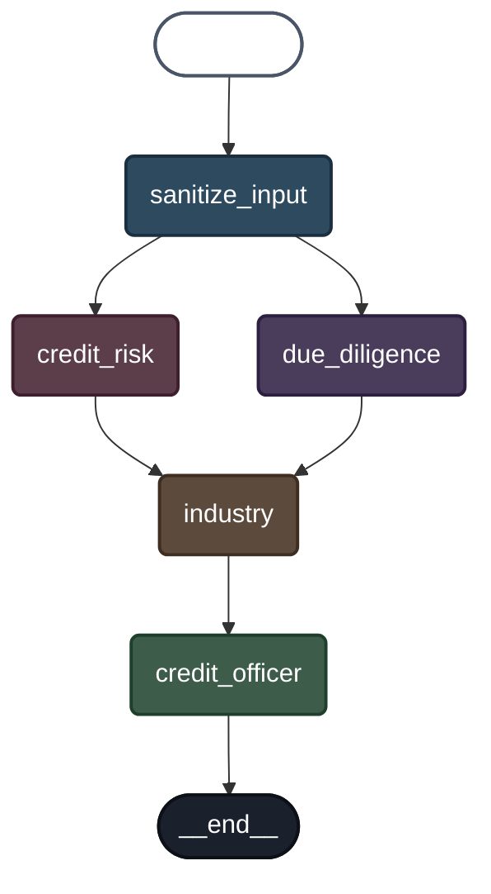

# Credit Committee LangGraph Visualization

This document contains a visual representation of the credit committee decision-making workflow implemented using LangGraph.

## Graph Structure

The credit committee workflow processes loan applications through multiple parallel and sequential agents that analyze different aspects of the application.

> **Note**: This diagram is based on the LangGraph model structure. The base structure can be generated using `app.get_graph().draw_mermaid()`, but the styling has been customized for better visibility on dark backgrounds with darker node colors and white text.



## Node Descriptions

### 1. **Sanitize Input** (Entry Point)
- **Purpose**: Validates and sanitizes input data
- **Input**: Raw loan application data
- **Output**: Cleaned and validated input data
- **State Update**: `input`

### 2. **Due Diligence Agent** (Parallel Execution)
- **Purpose**: Conducts company research
- **Tools Used**: Tavily Search API
- **Activities**:
  - Searches for recent company news
  - Researches company history
  - Investigates management team
- **State Update**: `due_diligence`
- **Runs in parallel with**: Credit Risk Agent

### 3. **Credit Risk Agent** (Parallel Execution)
- **Purpose**: Analyzes financial risk
- **Activities**:
  - Retrieves financial data (currently using mock data)
  - Computes Altman-Z score
  - Identifies major credit risks
- **State Update**: `credit_risk`
- **Runs in parallel with**: Due Diligence Agent

### 4. **Industry Agent** (Convergence Point)
- **Purpose**: Analyzes industry context
- **Tools Used**: Tavily Search API
- **Activities**:
  - Researches industry trends
  - Analyzes competitive landscape
  - Evaluates economic outlook
- **State Update**: `industry`
- **Waits for**: Both Due Diligence and Credit Risk agents to complete

### 5. **Credit Officer Agent** (Final Decision)
- **Purpose**: Makes final loan decision
- **Activities**:
  - Combines all agent outputs
  - Applies decision rules (e.g., Altman-Z > 2.6)
  - Generates credit memo
  - Makes Approve/Reject decision
- **State Update**: `credit_officer`
- **Finish Point**: Final output of the workflow

## Execution Flow

1. **Input Sanitization**: All loan applications start here
2. **Parallel Analysis**: Due Diligence and Credit Risk agents run simultaneously
3. **Industry Analysis**: Runs after both parallel agents complete
4. **Final Decision**: Credit Officer makes the final decision based on all analyses

## State Schema

The graph uses the following state structure:

```python
class State(TypedDict):
    input: dict              # Sanitized input data
    due_diligence: dict      # Due diligence research results
    industry: dict           # Industry analysis results
    credit_risk: dict        # Credit risk assessment
    credit_officer: dict     # Final decision and memo
```

## Decision Logic

The Credit Officer Agent uses the following rule-based logic:
- **Approve**: If Altman-Z score > 2.6 AND no major risks identified
- **Reject**: Otherwise

## Tools and APIs

- **Tavily Search API**: Used by Due Diligence and Industry agents for web research
- **AlphaVantage API**: (Commented out) Intended for financial data retrieval

